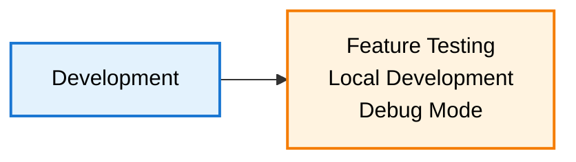
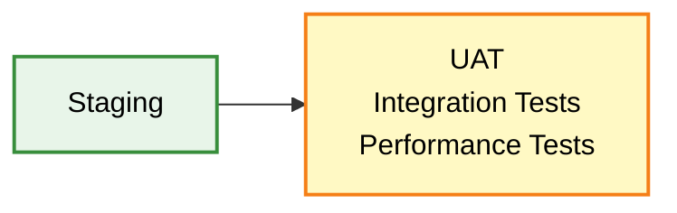
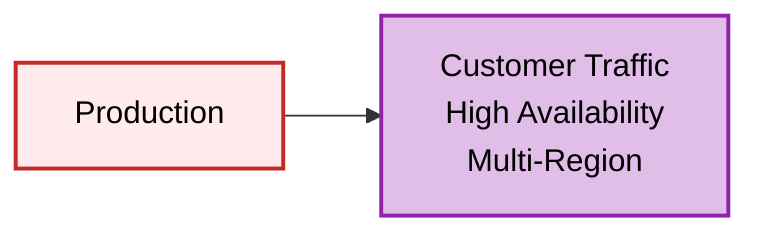
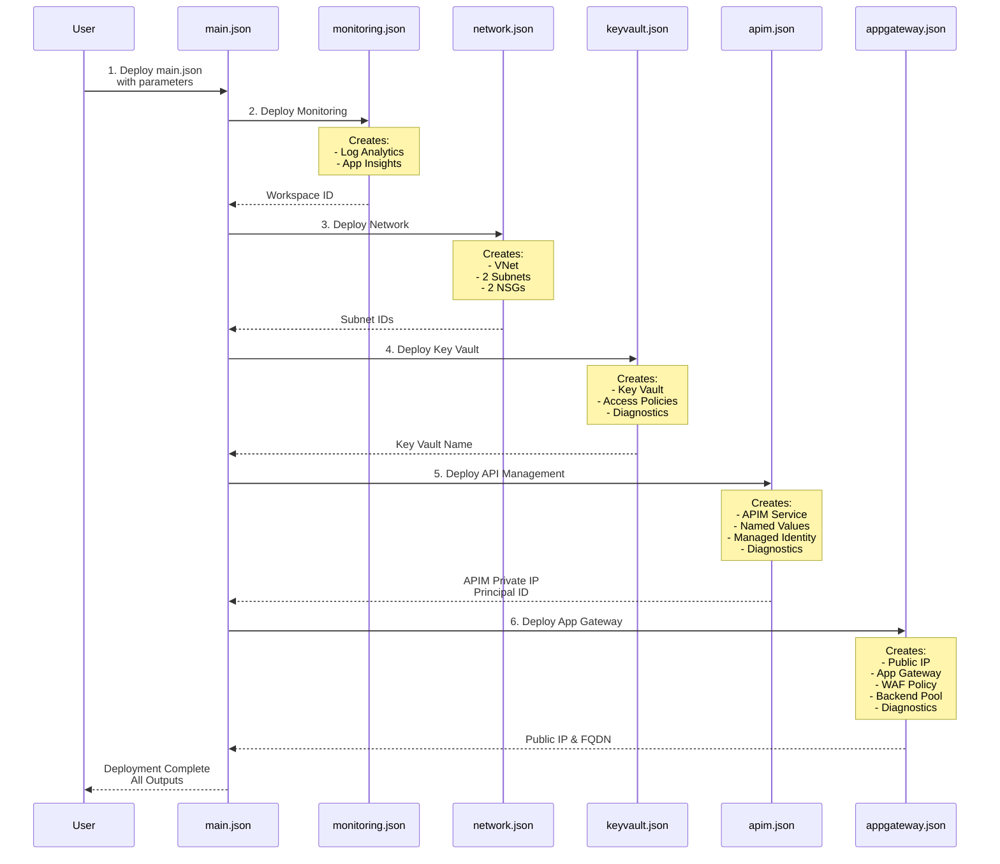
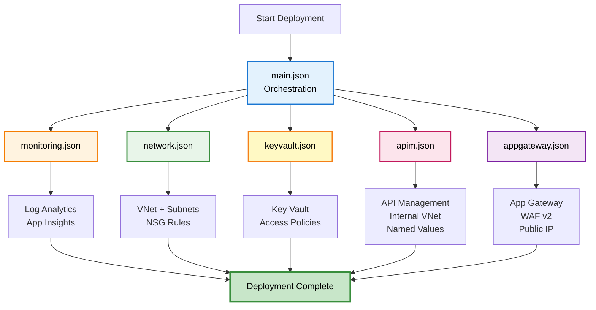
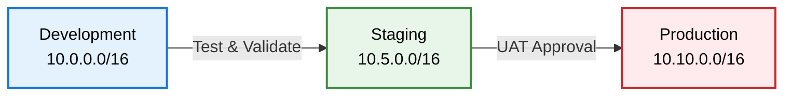

# Environment Comparison Guide

## 🌍 Quick Environment Reference

### Development Environment
**Purpose:** Local development, feature testing, debugging  
**Network:** 10.0.0.0/16  



**Configuration:**
- APIM SKU: Developer (1 unit)
- App Gateway: 2 instances
- WAF Mode: Detection (logs only)
- Log Retention: 30 days
- VNet: 10.0.0.0/16

---

### Staging Environment
**Purpose:** Pre-production testing, UAT, performance testing  
**Network:** 10.5.0.0/16  



**Configuration:**
- APIM SKU: Developer (1 unit)
- App Gateway: 2-7 instances (autoscale)
- WAF Mode: Prevention (blocks threats)
- Log Retention: 60 days
- VNet: 10.5.0.0/16

---

### Production Environment
**Purpose:** Live customer traffic, mission-critical workloads  
**Network:** 10.10.0.0/16  



**Configuration:**
- APIM SKU: Premium (2 units)
- App Gateway: 3-10 instances (autoscale)
- WAF Mode: Prevention (blocks threats)
- Log Retention: 90 days
- VNet: 10.10.0.0/16

---

## 📊 Side-by-Side Comparison

| Feature | Development | Staging | Production |
|---------|-------------|---------|------------|
| **APIM SKU** | Developer | Developer | Premium |
| **APIM Capacity** | 1 unit | 1 unit | 2 units |
| **Multi-Region** | ❌ No | ❌ No | ✅ Yes |
| **App Gateway Min** | 2 instances | 2 instances | 3 instances |
| **App Gateway Max** | 5 instances | 7 instances | 10 instances |
| **WAF Mode** | Detection | Prevention | Prevention |
| **Log Retention** | 30 days | 60 days | 90 days |
| **VNet Range** | 10.0.0.0/16 | 10.5.0.0/16 | 10.10.0.0/16 |
| **SLA** | None | None | 99.95% |
| **Use Case** | Dev & Debug | UAT & Testing | Production |

---

## 🏗️ ARM Template Deployment Sequence



---

## 📂 ARM Template Files Breakdown

### Template Execution Order



### File Descriptions

| File | Resources Created | Dependencies |
|------|-------------------|--------------|
| **main.json** | Orchestrates all deployments | None (entry point) |
| **monitoring.json** | Log Analytics Workspace<br/>Application Insights | None |
| **network.json** | Virtual Network<br/>APIM Subnet (10.x.1.0/24)<br/>App Gateway Subnet (10.x.2.0/24)<br/>NSG for APIM<br/>NSG for App Gateway | None |
| **keyvault.json** | Key Vault<br/>Admin Access Policy<br/>Diagnostic Settings | monitoring.json |
| **apim.json** | API Management Service<br/>Managed Identity<br/>Named Values (Auth0)<br/>Logger (App Insights)<br/>Diagnostics | network.json<br/>keyvault.json<br/>monitoring.json |
| **appgateway.json** | Public IP Address<br/>Application Gateway<br/>WAF Policy<br/>Backend Pool (to APIM)<br/>Listeners & Rules<br/>Diagnostics | network.json<br/>apim.json<br/>monitoring.json |

---

## 🚀 Deployment Commands

### Development
```bash
# Bash
./scripts/deploy.sh dev

# PowerShell
.\scripts\deploy.ps1 -Environment dev
```

### Staging
```bash
# Bash
./scripts/deploy.sh staging

# PowerShell
.\scripts\deploy.ps1 -Environment staging
```

### Production
```bash
# Bash
./scripts/deploy.sh prod

# PowerShell
.\scripts\deploy.ps1 -Environment prod
```

---

## 🔄 Promotion Path



**Typical Flow:**
1. **Dev**: Develop features, test locally
2. **Staging**: Integration tests, UAT, performance validation
3. **Production**: Deploy to customers

---

## 📋 Environment Checklist

### Before Deploying to Dev
- [ ] Update `dev.parameters.json` with Object ID
- [ ] Update Auth0 dev domain
- [ ] Configure backend URLs

### Before Deploying to Staging
- [ ] Copy working config from dev
- [ ] Update `staging.parameters.json`
- [ ] Enable WAF Prevention mode
- [ ] Configure staging Auth0 tenant
- [ ] Update MuleSoft staging endpoints

### Before Deploying to Production
- [ ] Validate in staging environment
- [ ] Review WAF exclusion rules
- [ ] Upload SSL certificates to Key Vault
- [ ] Configure custom domain DNS
- [ ] Enable all monitoring alerts
- [ ] Document runbook procedures
- [ ] Plan rollback strategy
- [ ] Notify stakeholders

---

## 🎯 Best Practices

### Development
- Use for rapid iteration
- Test breaking changes
- Debug with Detection mode WAF
- Quick feedback loops

### Staging
- Mirror production configuration
- Run full integration tests
- Validate performance under load
- Test disaster recovery
- Use Prevention mode WAF

### Production
- Premium SKU for SLA
- Multi-region for HA
- Comprehensive monitoring
- Regular security audits
- Automated backups

---

## 💡 Tips

**Network Isolation:**
- Each environment has separate VNet
- No network connectivity between environments
- Prevents accidental cross-environment access

**Testing Strategy:**
- Dev: Unit tests, feature validation
- Staging: Integration tests, UAT, load tests
- Prod: Monitoring, alerting, incident response

**Deployment Time:**
- Total deployment: 45-60 minutes
- APIM provisioning: 40-50 minutes (slowest)
- Network resources: 2-5 minutes
- App Gateway: 10-15 minutes

---

**Need Help?** Review the main README.md for detailed setup instructions.