# Azure API Management - Public Application Gateway Architecture

[](https://azure.microsoft.com/services/api-management/)
[](https://docs.microsoft.com/azure/azure-resource-manager/templates/)
[](LICENSE)

Production-ready ARM templates for deploying secure Azure API Management with public Application Gateway (WAF v2), Auth0 integration, and comprehensive security controls.

---

## 📊 Architecture Diagram

```mermaid
graph TB
    subgraph External["🌐 External Systems"]
        Client["Client Apps"]
        Auth0["Auth0<br/>Identity Provider"]
        MuleSoft["MuleSoft<br/>Platform"]
    end
    
    subgraph Azure["☁️ Azure Cloud"]
        PIP["Public IP<br/>+ FQDN"]
        AppGw["App Gateway<br/>WAF v2"]
        APIM["API Management<br/>Internal VNet"]
        KV["Key Vault"]
        Backend["Backend APIs"]
        Monitor["Monitoring<br/>LA + AI"]
    end
    
    Client -->|HTTPS| PIP
    Auth0 -->|HTTPS| PIP
    MuleSoft -->|HTTPS| PIP
    Auth0 -.->|JWT Token| Client
    
    PIP --> AppGw
    AppGw -->|Internal| APIM
    APIM -->|Validate| Auth0
    APIM -->|Secrets| KV
    APIM --> Backend
    APIM --> Monitor
    AppGw --> Monitor
    
    classDef light fill:#E3F2FD,stroke:#1976D2,stroke-width:2px,color:#000
    classDef lightsec fill:#FFF3E0,stroke:#F57C00,stroke-width:2px,color:#000
    classDef lightmon fill:#E8F5E9,stroke:#388E3C,stroke-width:2px,color:#000
    classDef lightpub fill:#FCE4EC,stroke:#C2185B,stroke-width:2px,color:#000
    classDef lightback fill:#F3E5F5,stroke:#7B1FA2,stroke-width:2px,color:#000
    
    class Client,Auth0,MuleSoft light
    class PIP,AppGw lightpub
    class APIM lightsec
    class KV,Monitor lightmon
    class Backend lightback
```



---

## 🔄 Request Flow Sequence


---

## 🏗️ Infrastructure Components


---

## 🌐 Traffic Flow

### External Clients
- **Client Applications**: Mobile apps, web apps, SPAs
- **Auth0**: Issues JWT tokens, validates tokens via JWKS endpoint  
- **MuleSoft**: External integration platform acting as an API client (connects TO your API Gateway)

### Flow Pattern
```
External Clients (Client Apps, Auth0, MuleSoft)
    ↓ HTTPS (443) - Public Internet
Public IP / FQDN (Static IP Address)
    ↓
Application Gateway WAF v2 (Public Frontend)
    ↓ Internal VNet Traffic
API Management (Internal VNet Mode)
    ↓ validates JWT, applies policies
Backend APIs (Your microservices, legacy systems, databases)
```

### Key Clarification
- **MuleSoft is NOT a backend** - it's an external client that makes API calls
- **Backend APIs** are your actual services that APIM routes to (e.g., microservices, databases)
- **Auth0** provides authentication; APIM validates tokens but doesn't route to Auth0

---

## 📁 Folder Structure

```
arm-templates-public-apim/
│
├── templates/                          # ARM Template Files
│   ├── main.json                       # Main orchestration template
│   ├── network.json                    # VNet, Subnets, NSGs
│   ├── apim.json                       # API Management Service
│   ├── appgateway.json                 # Application Gateway + WAF (Public)
│   ├── keyvault.json                   # Azure Key Vault
│   └── monitoring.json                 # Log Analytics + App Insights
│
├── parameters/                         # Environment Parameters
│   ├── dev.parameters.json             # Development environment
│   ├── staging.parameters.json         # Staging environment
│   └── prod.parameters.json            # Production environment
│
├── policies/                           # APIM Policy Templates
│   ├── api-auth0-policy.xml            # Auth0 JWT validation
│   └── mulesoft-integration-policy.xml # MuleSoft client handling
│
├── scripts/                            # Deployment Scripts
│   ├── deploy.sh                       # Bash deployment script
│   └── deploy.ps1                      # PowerShell deployment script
│
└── README.md                           # This file
```

---

## 🚀 Quick Start

### Prerequisites

1. **Azure CLI** or **Azure PowerShell**
2. **Azure AD Object ID** (for Key Vault access)
3. **Auth0 Account** (tenant domain and API audience)

### Step 1: Get Azure AD Object ID

```bash
# Azure CLI
az ad signed-in-user show --query id -o tsv

# PowerShell
(Get-AzADUser -UserPrincipalName (Get-AzContext).Account).Id
```

### Step 2: Update Parameters

Edit `parameters/dev.parameters.json`:

```json
{
  "adminObjectId": {
    "value": "YOUR-AZURE-AD-OBJECT-ID"
  },
  "auth0Domain": {
    "value": "your-tenant.auth0.com"
  },
  "auth0Audience": {
    "value": "https://api.yourdomain.com"
  },
  "backendServiceUrl": {
    "value": "https://backend.yourdomain.com"  // OPTIONAL: Your actual backend API
  }
}
```

**Note:** MuleSoft doesn't need to be configured here - it's an external client that calls your API Gateway, just like any other client application.

### Step 3: Deploy

**Using Bash:**
```bash
chmod +x scripts/deploy.sh

# Development
./scripts/deploy.sh dev

# Staging
./scripts/deploy.sh staging

# Production
./scripts/deploy.sh prod
```

**Using PowerShell:**
```powershell
# Development
.\scripts\deploy.ps1 -Environment dev

# Staging
.\scripts\deploy.ps1 -Environment staging

# Production
.\scripts\deploy.ps1 -Environment prod
```

**Deployment Time:** 45-60 minutes

---

## ⚙️ Configuration

### Environment-Specific Settings

| Parameter | Development | Staging | Production |
|-----------|-------------|---------|------------|
| `vnetAddressPrefix` | 10.0.0.0/16 | 10.5.0.0/16 | 10.10.0.0/16 |
| `apimSubnetPrefix` | 10.0.1.0/24 | 10.5.1.0/24 | 10.10.1.0/24 |
| `appGatewaySubnetPrefix` | 10.0.2.0/24 | 10.5.2.0/24 | 10.10.2.0/24 |
| `apimSku` | Developer | Developer | Premium |
| `apimCapacity` | 1 | 1 | 2 |
| `appGatewayCapacity` | 2 | 2 | 3-10 |
| `appGatewayMaxCapacity` | 5 | 7 | 10 |
| `enableWafPreventionMode` | false (Detection) | true (Prevention) | true (Prevention) |
| `logRetentionDays` | 30 days | 60 days | 90 days |
| **Est. Monthly Cost** | ~$340 | ~$340 | ~$6,716-8,016 |

### Network Layout

**Development (10.0.0.0/16):**
- APIM Subnet: 10.0.1.0/24
- App Gateway Subnet: 10.0.2.0/24

**Staging (10.5.0.0/16):**
- APIM Subnet: 10.5.1.0/24
- App Gateway Subnet: 10.5.2.0/24

**Production (10.10.0.0/16):**
- APIM Subnet: 10.10.1.0/24
- App Gateway Subnet: 10.10.2.0/24

---

## 🔧 Deployment Outputs

After successful deployment, you'll receive:

```json
{
  "apimName": "myproject-dev-apim",
  "apimGatewayUrl": "https://myproject-dev-apim.azure-api.net",
  "appGatewayPublicIp": "52.168.117.42",
  "appGatewayFqdn": "myproject-dev-appgw.eastus.cloudapp.azure.com",
  "keyVaultName": "myprojectdevkv"
}
```

### Access Your API

**Option 1: Use Auto-Generated FQDN**
```bash
curl -H "Authorization: Bearer $TOKEN" \
  https://myproject-dev-appgw.eastus.cloudapp.azure.com/api/v1/endpoint
```

**Option 2: Configure Custom Domain**
1. Create DNS A record pointing to Public IP
2. Upload SSL certificate to Key Vault
3. Configure App Gateway listener

---

## 📝 Post-Deployment Steps

### 1. Configure Auth0

```bash
# Create Auth0 Application
# 1. Go to Auth0 Dashboard → Applications
# 2. Create Machine-to-Machine or Web App
# 3. Note: Domain, Client ID, Client Secret

# Create Auth0 API
# 1. Go to Auth0 Dashboard → APIs
# 2. Create API with identifier: https://api.yourdomain.com
# 3. Configure permissions/scopes
```

### 2. Upload SSL Certificate

```bash
az keyvault certificate import \
  --vault-name myprojectdevkv \
  --name api-ssl-cert \
  --file certificate.pfx \
  --password "cert-password"
```

### 3. Grant APIM Access to Key Vault

```bash
APIM_PRINCIPAL_ID=$(az apim show \
  --resource-group rg-apim-public-dev \
  --name myproject-dev-apim \
  --query identity.principalId -o tsv)

az keyvault set-policy \
  --name myprojectdevkv \
  --object-id $APIM_PRINCIPAL_ID \
  --secret-permissions get list
```

### 4. Import APIs

```bash
az apim api import \
  --resource-group rg-apim-public-dev \
  --service-name myproject-dev-apim \
  --path /api/v1 \
  --specification-path openapi.json \
  --specification-format OpenApiJson \
  --api-id my-api
```

### 5. Apply APIM Policies

```bash
# Apply Auth0 JWT validation policy
az apim api policy create \
  --resource-group rg-apim-public-dev \
  --service-name myproject-dev-apim \
  --api-id my-api \
  --xml-content @policies/api-auth0-policy.xml
```

### 6. Test End-to-End

```bash
# Get Auth0 token
TOKEN=$(curl --request POST \
  --url https://your-tenant.auth0.com/oauth/token \
  --header 'content-type: application/json' \
  --data '{
    "client_id":"YOUR_CLIENT_ID",
    "client_secret":"YOUR_CLIENT_SECRET",
    "audience":"https://api.yourdomain.com",
    "grant_type":"client_credentials"
  }' | jq -r '.access_token')

# Test API call
curl -X GET \
  -H "Authorization: Bearer $TOKEN" \
  -H "Content-Type: application/json" \
  https://myproject-dev-appgw.eastus.cloudapp.azure.com/api/v1/test
```

---

## 🔒 Security Features

### Multi-Layer Security

1. **WAF v2 Protection (Layer 1)**
   - OWASP 3.2 rules
   - SQL injection prevention
   - XSS protection
   - Rate limiting (100 req/min per IP)
   - Geo-blocking capabilities

2. **TLS Encryption (Layer 2)**
   - TLS 1.2+ enforcement
   - TLS 1.0/1.1 disabled
   - Strong cipher suites only

3. **JWT Authentication (Layer 3)**
   - Auth0 JWT signature verification
   - Token expiration check
   - Audience validation
   - Issuer validation
   - Scope/permission check

4. **Rate Limiting (Layer 4)**
   - Per-user: 100 requests/minute
   - Per-subscription: 10,000 requests/day

5. **Network Security (Layer 5)**
   - NSG rules with least privilege
   - Internal VNet for APIM
   - Service endpoints for Azure services

6. **Managed Identity (Layer 6)**
   - No stored credentials
   - Azure AD authentication
   - Key Vault access via identity

---


## 📊 Monitoring Queries

### API Request Rate
```kusto
ApiManagementGatewayLogs
| where TimeGenerated > ago(1h)
| summarize RequestCount = count() by bin(TimeGenerated, 5m)
| render timechart
```

### Response Time Distribution
```kusto
ApiManagementGatewayLogs
| where TimeGenerated > ago(1h)
| summarize 
    P50 = percentile(DurationMs, 50),
    P95 = percentile(DurationMs, 95),
    P99 = percentile(DurationMs, 99)
  by bin(TimeGenerated, 5m)
| render timechart
```

### Error Rate
```kusto
ApiManagementGatewayLogs
| where TimeGenerated > ago(1h)
| summarize 
    Total = count(),
    Errors = countif(ResponseCode >= 400)
  by bin(TimeGenerated, 5m)
| extend ErrorRate = (Errors * 100.0) / Total
| render timechart
```

### WAF Blocks
```kusto
AzureDiagnostics
| where Category == "ApplicationGatewayFirewallLog"
| where action_s == "Blocked"
| summarize BlockCount = count() by ruleId_s, Message
| order by BlockCount desc
```

---

## 🆘 Troubleshooting

### Common Issues

| Issue | Symptom | Solution |
|-------|---------|----------|
| **Deployment Timeout** | APIM provisioning >60 min | Normal - check status with `az apim show` |
| **Cannot Access App Gateway** | Connection refused | Check NSG allows 443, verify WAF isn't blocking |
| **JWT Validation Fails** | 401 Unauthorized | Verify Auth0 domain/audience in APIM named values |
| **WAF Blocking Requests** | 403 Forbidden | Check WAF logs, adjust rules or add exclusions |
| **Key Vault Access Denied** | APIM can't read secrets | Grant Managed Identity permissions |

### Diagnostic Commands

```bash
# Check APIM status
az apim show \
  --resource-group rg-apim-public-dev \
  --name myproject-dev-apim \
  --query provisioningState

# Check App Gateway backend health
az network application-gateway show-backend-health \
  --resource-group rg-apim-public-dev \
  --name myproject-dev-appgw

# View WAF logs
az monitor diagnostic-settings show \
  --resource-id /subscriptions/.../applicationGateways/myproject-dev-appgw \
  --name appgateway-diagnostics
```

---

## 📚 Additional Resources

### Microsoft Documentation
- [Azure API Management](https://docs.microsoft.com/azure/api-management/)
- [Application Gateway](https://docs.microsoft.com/azure/application-gateway/)
- [WAF Best Practices](https://docs.microsoft.com/azure/web-application-firewall/ag/best-practices)
- [ARM Templates Reference](https://docs.microsoft.com/azure/templates/)

### Auth0 Resources
- [Auth0 Documentation](https://auth0.com/docs)
- [JWT Validation](https://auth0.com/docs/secure/tokens/json-web-tokens)
- [Machine-to-Machine Apps](https://auth0.com/docs/get-started/authentication-and-authorization-flow/client-credentials-flow)

### MuleSoft Integration
- [MuleSoft API Documentation](https://docs.mulesoft.com/)
- [API-Led Connectivity](https://www.mulesoft.com/resources/api-led-connectivity)

---

## 🎉 Summary

This architecture provides a production-ready Azure API Management solution with:

- ✅ Public-facing Application Gateway with WAF v2
- ✅ Internal API Management for security
- ✅ Auth0 authentication integration
- ✅ Support for external clients (including MuleSoft integration platforms)
- ✅ Comprehensive monitoring and logging
- ✅ Infrastructure as Code with ARM templates
- ✅ Multi-layer security controls


