# Azure API Management - ARM Templates (Private Endpoint Architecture)

[](https://azure.microsoft.com/services/api-management/)
[](https://docs.microsoft.com/azure/azure-resource-manager/templates/)
[](LICENSE)

Production-ready ARM templates for deploying secure Azure API Management architecture with Application Gateway (WAF v2), Private Endpoint connectivity, Auth0 integration, and comprehensive security controls.

---

## 📊 Architecture Diagram


---

## 🔄 Request Flow Sequence

```mermaid
sequenceDiagram
    actor User as 👤 User
    participant Auth0 as 🔐 Auth0
    participant PE as 🔒 Private Endpoint
    participant DNS as 🌐 Private DNS
    participant WAF as 🛡️ WAF v2
    participant AppGw as 🚪 App Gateway
    participant APIM as 🎯 APIM
    participant KV as 🔑 Key Vault
    participant Backend as 🖥️ Backend API
    participant LA as 📊 Log Analytics
    
    User->>Auth0: 1. POST /oauth/token<br/>(client_credentials)
    Auth0-->>User: 2. JWT Access Token<br/>(expires: 3600s)
    
    User->>DNS: 3. Resolve api.contoso.com
    DNS-->>User: 4. Private IP: 10.0.3.10
    
    User->>PE: 5. GET /api/resource<br/>Authorization: Bearer {token}<br/>(to 10.0.3.10)
    PE->>WAF: 6. Forward via Private Network
    
    WAF->>WAF: 7. Inspect Request<br/>- OWASP Rules<br/>- SQL Injection Check<br/>- XSS Check
    
    alt Malicious Request
        WAF-->>User: 403 Forbidden<br/>Blocked by WAF
    else Clean Request
        WAF->>AppGw: 8. Forward to Backend Pool
        AppGw->>APIM: 9. HTTPS Request<br/>TLS 1.2 Encrypted
        
        APIM->>APIM: 10. Extract JWT from Header
        APIM->>Auth0: 11. Validate JWT<br/>GET /.well-known/openid-configuration
        Auth0-->>APIM: 12. JWKS Keys + Validation
        
        alt Invalid/Expired Token
            APIM-->>User: 401 Unauthorized<br/>Invalid Token
        else Valid Token
            APIM->>APIM: 13. Apply Policies<br/>- Rate Limit Check<br/>- Quota Check<br/>- Transform Request
            
            alt Rate Limit Exceeded
                APIM-->>User: 429 Too Many Requests
            else Within Limits
                APIM->>KV: 14. Get Backend Secrets<br/>(Managed Identity)
                KV-->>APIM: 15. Return Secrets
                
                APIM->>Backend: 16. Backend API Call<br/>+ Headers + Auth
                Backend-->>APIM: 17. API Response (200 OK)
                
                APIM->>APIM: 18. Transform Response<br/>- Add Security Headers<br/>- Remove Sensitive Data
                
                APIM->>LA: 19. Log Request<br/>(Response Time, Status)
                
                APIM-->>AppGw: 20. Return Response
                AppGw-->>PE: 21. Forward Response
                PE-->>User: 22. Final Response<br/>+ Security Headers
            end
        end
    end
    
    Note over LA: All requests logged<br/>for audit & analytics
```



---

## 🏗️ Infrastructure Components


---

## 📁 Folder Structure

```
arm-templates-private-endpoint/
│
├── templates/                          # ARM Template Files
│   ├── main.json                       # Main orchestration template
│   ├── network.json                    # VNet, Subnets, NSGs
│   ├── private-endpoint.json           # Private Endpoint configuration
│   ├── private-dns.json                # Private DNS Zone
│   ├── apim.json                       # API Management Service
│   ├── appgateway.json                 # Application Gateway + WAF (Private Frontend)
│   ├── keyvault.json                   # Azure Key Vault
│   └── monitoring.json                 # Log Analytics + App Insights
│
├── parameters/                         # Environment Parameters
│   ├── dev.parameters.json             # Development environment
│   └── prod.parameters.json            # Production environment
│
├── policies/                           # APIM Policy Templates
│   ├── api-auth0-policy.xml            # Auth0 JWT validation
│   └── mulesoft-integration-policy.xml # MuleSoft backend integration
│
├── scripts/                            # Deployment Scripts
│   ├── deploy.sh                       # Bash deployment script
│   └── deploy.ps1                      # PowerShell deployment script
│
└── README.md                           # This file
```

---

## 🎯 What Gets Deployed

### Core Resources

| Resource | SKU/Tier | Purpose | Estimated Cost/Month |
|----------|----------|---------|---------------------|
| **Virtual Network** | Standard | Network isolation for APIM and App Gateway | Included |
| **Network Security Groups (3)** | Standard | Inbound/outbound traffic rules | Included |
| **Private Endpoint** | Standard | Private connectivity to App Gateway | ~$8 |
| **Private DNS Zone** | Standard | Name resolution for private endpoint | ~$0.50 |
| **Application Gateway** | WAF_v2 | Web Application Firewall, 2 instances | ~$320 |
| **API Management** | Developer | API gateway, policies, analytics | ~$50 |
| **Key Vault** | Standard | Secrets and certificate storage | ~$1 |
| **Log Analytics** | Pay-as-you-go | Centralized logging (5GB free) | ~$10-50 |
| **Application Insights** | Standard | APM and distributed tracing | ~$0-20 |

**Total Estimated Cost:**
- **Development**: ~$400-450/month (Developer APIM, 2 App Gateway instances)
- **Production**: ~$1,800-2,200/month (Premium APIM, 5 App Gateway instances, higher monitoring)

---

## 🔑 Key Features

### 🔒 Private Endpoint Connectivity

✅ **No Public IP Exposure**: Application Gateway accessible only via Private Endpoint  
✅ **Private DNS Integration**: Automatic name resolution within VNet  
✅ **Network Isolation**: Complete traffic containment within Azure backbone  
✅ **Private Link Service**: Secure connectivity for external partners  
✅ **Cross-VNet Peering**: Support for hub-spoke topologies  

### 🛡️ Enhanced Security

✅ **Zero Trust Architecture**: All communication via private network  
✅ **Network Segmentation**: Separate subnets for each tier  
✅ **Service Endpoints**: Direct paths to Azure services  
✅ **Private DNS Zones**: Internal name resolution only  
✅ **NSG Protection**: Defense in depth at every layer  

### 🎯 Multi-Tenant SaaS Ready

✅ **Auth0 JWT Validation**: OpenID Connect integration with token validation  
✅ **Rate Limiting**: Per-user and per-IP throttling policies  
✅ **API Versioning**: Support for multiple API versions  
✅ **Request/Response Transformation**: Protocol translation and data mapping  
✅ **Circuit Breaker Pattern**: Automatic backend failure handling  

### 🔌 MuleSoft Integration

✅ **Backend Routing**: Seamless integration with MuleSoft APIs  
✅ **Header Propagation**: Forward authentication context  
✅ **Error Handling**: Comprehensive retry and fallback logic  
✅ **Caching Policies**: Reduce backend load with intelligent caching  

### 📊 Observability

✅ **Distributed Tracing**: End-to-end request tracking  
✅ **Centralized Logging**: All logs in Log Analytics workspace  
✅ **Custom Metrics**: Business KPIs and technical metrics  
✅ **Alert Rules**: Proactive issue detection  
✅ **Dashboards**: Real-time operational visibility  

---

## 🔐 Security Features

| Layer | Feature | Implementation | Status |
|-------|---------|----------------|--------|
| **Network** | Private Endpoint | App Gateway via Private Link | ✅ |
| | VNet Isolation | APIM in Internal VNet mode | ✅ |
| | NSG Rules | Least privilege access | ✅ |
| | Service Endpoints | Storage, SQL, KeyVault | ✅ |
| | Private DNS | Internal name resolution | ✅ |
| **Application** | WAF | OWASP 3.2, Prevention mode | ✅ |
| | TLS | 1.2+ only, strong ciphers | ✅ |
| | Rate Limiting | IP & User-based | ✅ |
| **Identity** | JWT Validation | Auth0 OpenID Connect | ✅ |
| | Managed Identity | APIM → Key Vault | ✅ |
| | RBAC | Azure AD integration | ✅ |
| **Data** | Secrets | Key Vault storage | ✅ |
| | Soft Delete | 90-day retention | ✅ |
| | Purge Protection | Prevent permanent deletion | ✅ |

---

## 🎛️ Configuration Guide

### Parameter File Structure

```json
{
  "$schema": "https://schema.management.azure.com/schemas/2019-04-01/deploymentParameters.json#",
  "contentVersion": "1.0.0.0",
  "parameters": {
    "projectName": {
      "value": "contoso-api"              // Project identifier
    },
    "environment": {
      "value": "dev"                       // dev, staging, prod
    },
    "location": {
      "value": "eastus"                    // Azure region
    },
    "vnetAddressPrefix": {
      "value": "10.0.0.0/16"              // VNet CIDR
    },
    "apimSubnetPrefix": {
      "value": "10.0.1.0/24"              // APIM subnet
    },
    "appGwSubnetPrefix": {
      "value": "10.0.2.0/24"              // App Gateway subnet
    },
    "privateEndpointSubnetPrefix": {
      "value": "10.0.3.0/24"              // Private Endpoint subnet
    },
    "privateEndpointStaticIP": {
      "value": "10.0.3.10"                // Static IP for Private Endpoint
    },
    "apimPublisherEmail": {
      "value": "admin@contoso.com"         // APIM admin email
    },
    "apimPublisherName": {
      "value": "Contoso Ltd"               // Publisher name
    },
    "apimSku": {
      "value": "Developer"                 // Developer or Premium
    },
    "appGatewayCapacity": {
      "value": 2                           // Number of instances
    },
    "auth0Domain": {
      "value": "contoso.auth0.com"         // Auth0 tenant domain
    },
    "auth0Audience": {
      "value": "https://api.contoso.com"   // API audience identifier
    },
    "privateDnsZoneName": {
      "value": "privatelink.azurewebsites.net"  // Private DNS zone
    },
    "adminObjectId": {
      "value": "YOUR-AZURE-AD-OBJECT-ID"   // For Key Vault access
    }
  }
}
```

### Environment-Specific Settings

| Parameter | Development | Production |
|-----------|-------------|------------|
| `apimSku` | Developer | Premium |
| `appGatewayCapacity` | 2 | 3-5 |
| `vnetAddressPrefix` | 10.0.0.0/16 | 10.10.0.0/16 |
| `privateEndpointSubnetPrefix` | 10.0.3.0/24 | 10.10.3.0/24 |
| Monitoring Retention | 30 days | 90 days |

---

## 🔧 Deployment Commands

### Azure CLI Deployment

```bash
# Create resource group
az group create \
  --name rg-apim-private-dev \
  --location eastus

# Validate template
az deployment group validate \
  --resource-group rg-apim-private-dev \
  --template-file templates/main.json \
  --parameters @parameters/dev.parameters.json

# What-If deployment (preview changes)
az deployment group what-if \
  --resource-group rg-apim-private-dev \
  --template-file templates/main.json \
  --parameters @parameters/dev.parameters.json

# Deploy
az deployment group create \
  --name apim-private-deployment \
  --resource-group rg-apim-private-dev \
  --template-file templates/main.json \
  --parameters @parameters/dev.parameters.json \
  --verbose
```

### PowerShell Deployment

```powershell
# Connect to Azure
Connect-AzAccount

# Create resource group
New-AzResourceGroup `
  -Name "rg-apim-private-dev" `
  -Location "eastus"

# Validate template
Test-AzResourceGroupDeployment `
  -ResourceGroupName "rg-apim-private-dev" `
  -TemplateFile "templates/main.json" `
  -TemplateParameterFile "parameters/dev.parameters.json"

# Deploy
New-AzResourceGroupDeployment `
  -Name "apim-private-deployment" `
  -ResourceGroupName "rg-apim-private-dev" `
  -TemplateFile "templates/main.json" `
  -TemplateParameterFile "parameters/dev.parameters.json" `
  -Verbose
```

---

### Benefits of Private Endpoint Architecture
1. **Enhanced Security**: No internet-facing endpoints
2. **Compliance**: Meets strict regulatory requirements
3. **Network Isolation**: Complete traffic containment
4. **Reduced Attack Surface**: No public IP to scan or attack
5. **Private Link Support**: Enables secure partner connectivity

---

## 📊 Monitoring Queries

### Key Performance Indicators

```kusto
// API Request Rate
ApiManagementGatewayLogs
| where TimeGenerated > ago(1h)
| summarize RequestCount = count() by bin(TimeGenerated, 5m)
| render timechart

// Response Time Distribution
ApiManagementGatewayLogs
| where TimeGenerated > ago(1h)
| summarize 
    P50 = percentile(DurationMs, 50),
    P95 = percentile(DurationMs, 95),
    P99 = percentile(DurationMs, 99)
  by bin(TimeGenerated, 5m)
| render timechart

// Error Rate
ApiManagementGatewayLogs
| where TimeGenerated > ago(1h)
| summarize 
    Total = count(),
    Errors = countif(ResponseCode >= 400)
  by bin(TimeGenerated, 5m)
| extend ErrorRate = (Errors * 100.0) / Total
| render timechart

// WAF Blocks
AzureDiagnostics
| where Category == "ApplicationGatewayFirewallLog"
| where action_s == "Blocked"
| summarize BlockCount = count() by ruleId_s, Message
| order by BlockCount desc

// Private Endpoint Connection Status
AzureDiagnostics
| where ResourceType == "PRIVATEENDPOINTS"
| where TimeGenerated > ago(1h)
| summarize count() by connectionStatus_s, bin(TimeGenerated, 5m)
| render timechart
```

---

## 🆘 Troubleshooting

### Common Issues

| Issue | Symptom | Solution |
|-------|---------|----------|
| **Deployment Timeout** | APIM provisioning takes >60 min | Normal - APIM can take 45-60 minutes |
| **Private Endpoint Not Resolving** | DNS resolution fails | Verify Private DNS Zone is linked to VNet |
| **NSG Blocking Traffic** | 403 errors from APIM | Verify NSG rules allow traffic from App Gateway subnet |
| **JWT Validation Fails** | 401 Unauthorized | Check auth0Domain and auth0Audience in APIM named values |
| **WAF Blocking Legitimate Requests** | 403 from WAF | Review WAF logs, add exclusions if needed |
| **Key Vault Access Denied** | APIM can't read secrets | Verify Managed Identity has Get/List permissions |
| **Private Endpoint Connection Failed** | Can't reach App Gateway | Check subnet delegation and NSG rules |

### Diagnostic Commands

```bash
# Check Private Endpoint status
az network private-endpoint show \
  --resource-group rg-apim-private-dev \
  --name pe-appgw-dev \
  --query provisioningState

# Check Private DNS Zone
az network private-dns zone show \
  --resource-group rg-apim-private-dev \
  --name privatelink.azurewebsites.net

# Check APIM status
az apim show \
  --resource-group rg-apim-private-dev \
  --name myproject-dev-apim \
  --query provisioningState

# Check App Gateway backend health
az network application-gateway show-backend-health \
  --resource-group rg-apim-private-dev \
  --name myproject-dev-appgw

# View recent deployments
az deployment group list \
  --resource-group rg-apim-private-dev \
  --query "[].{Name:name, State:properties.provisioningState, Timestamp:properties.timestamp}" \
  --output table

# Test DNS resolution (from within VNet)
nslookup api.contoso.com
# Should resolve to 10.0.3.10
```

---

## 📚 Additional Resources

### Microsoft Documentation
- [Azure Private Endpoint](https://docs.microsoft.com/azure/private-link/private-endpoint-overview)
- [Azure Private DNS](https://docs.microsoft.com/azure/dns/private-dns-overview)
- [Azure API Management](https://docs.microsoft.com/azure/api-management/)
- [Application Gateway](https://docs.microsoft.com/azure/application-gateway/)
- [ARM Templates Reference](https://docs.microsoft.com/azure/templates/)

### Best Practices
- [Private Link Best Practices](https://docs.microsoft.com/azure/private-link/private-link-overview#best-practices)
- [APIM Best Practices](https://docs.microsoft.com/azure/api-management/api-management-howto-deploy-multi-region)
- [WAF Best Practices](https://docs.microsoft.com/azure/web-application-firewall/ag/best-practices)

### Auth0 Integration
- [Auth0 Documentation](https://auth0.com/docs)
- [JWT Validation](https://auth0.com/docs/secure/tokens/json-web-tokens)
- [OpenID Connect](https://auth0.com/docs/authenticate/protocols/openid-connect-protocol)

---


## 🎉 Summary

This architecture provides a fully private, secure, and production-ready Azure API Management solution with:


- ✅ Private Endpoint connectivity
- ✅ Enterprise-grade security with WAF
- ✅ Auth0 authentication integration
- ✅ MuleSoft backend support
- ✅ Comprehensive monitoring and logging
- ✅ Infrastructure as Code with ARM templates

Perfect for organizations requiring strict network isolation and compliance with regulatory requirements.

---